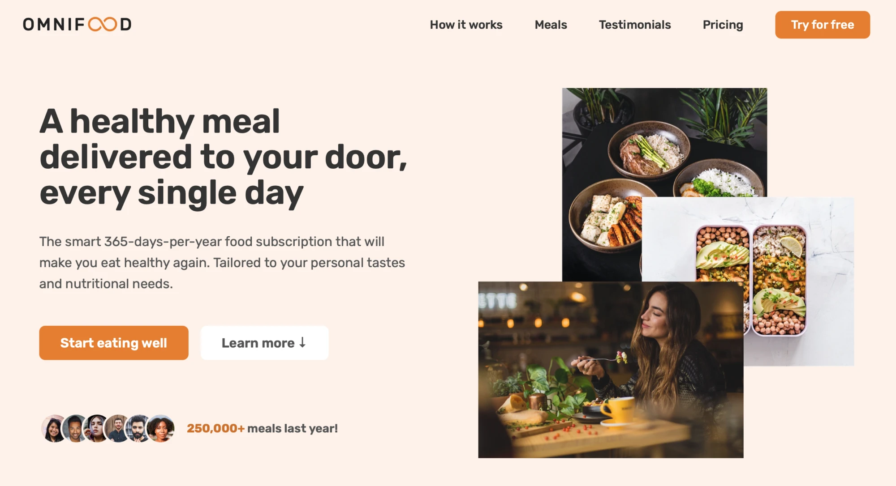
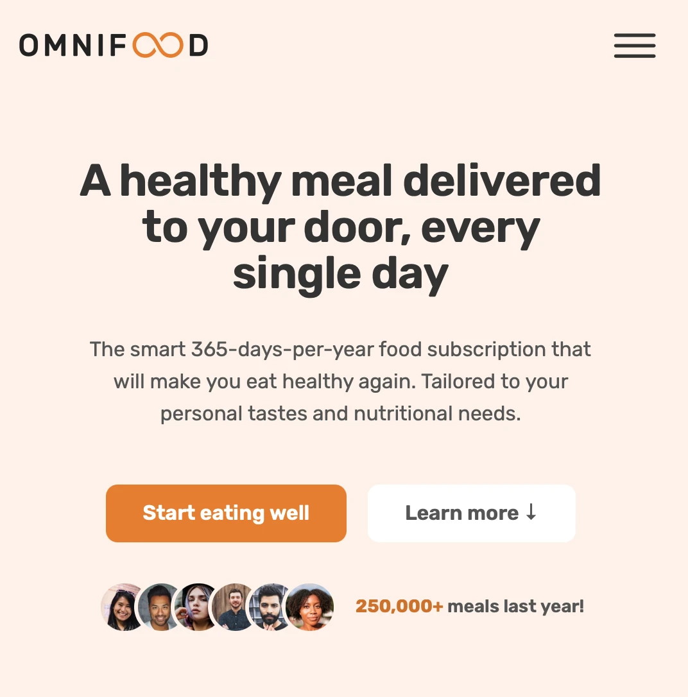

# omniFood 
Landing-page for fictional start-up made as a test task, using materials and design from HTML-CSS course by [Jonas Schmedtmann](https://codingheroes.io) (Udemy).
[Check the site here](https://omnifood-peknyimax.netlify.app). 

### Uses:

- Flexbox  
- CSS Grids
- Responsive design

<!--  -->

<!--  -->

